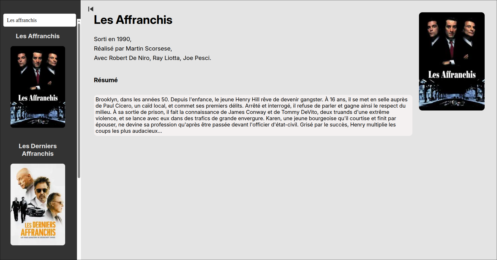

# 🎬 Movies Presentation 🎬

[English Version Below]



## Sommaire

- [Introduction](#introduction)

- [Déploiement](#déploiement)

## Introduction

Ce projet a été réalisé dans le cadre du processus de recrutement de l'entreprise [Fleet](https://fleet.co/), et utilise [l'API de TMDB](https://developer.themoviedb.org/docs/getting-started). Le projet a été réalisé en React.

Le but de l'exercice était d'implémenter l'API de TMDB pour réaliser une interface contenant une recherche de film dans un menu à gauche et capable d'afficher le poster et les caractéristiques du film à droite.

## Déploiement

### Obtention de la clé API

Allez sur [le site de TMDB](https://www.themoviedb.org/) et générez une clé API et un request token. Puis faites :

```bash
cp .env_template .env
```

et copiez le request token à la place de `xxx`.

Il y a 2 méthodes pour déployer l'interface localement :

### Via npm

Pour déployer le site directement avec npm faites :

```bash
npm install
npm start
```

et l'interface va apparaître dans votre navigateur.

### Via Docker

Sinon vous pouvez déployer le site directement avec Docker si vous voulez éviter les problèmes de dépendances. Faites :

```bash
sudo docker build . -t movies
sudo docker run -p 8080:3000 movies
```

Et le site sera présent à l'adresse `http://localhost:8080` .

## English Version

## Summary

- [Intro](#intro)

- [Deployment](#deployment)

## Intro

This project was carried out as part of the recruitment process for the company [Fleet](https://fleet.co/), and uses [the TMDB API](https://developer.themoviedb.org/docs/getting-started). The project was carried out in React.

The goal of the exercise was to implement the TMDB API to create an interface containing a movie search in a menu on the left and capable of displaying the movie poster and characteristics on the right.

## Deployment

### Obtaining the API key

Go to [the TMDB website](https://www.themoviedb.org/) and generate an API key and a request token. Then do:

```bash
cp .env_template .env
```

and copy the request token in place of `xxx`.

There are two methods for deploying the interface locally:

### Via npm

To deploy the site directly with npm, do:

```bash
npm install
npm start
```

and the interface will appear in your browser.

### Via Docker

Alternatively, you can deploy the site directly with Docker if you want to avoid dependency issues. Do:

```bash
sudo docker build . -t movies
sudo docker run -p 8080:3000 movies
```

And the site will be available at `http://localhost:8080`.
